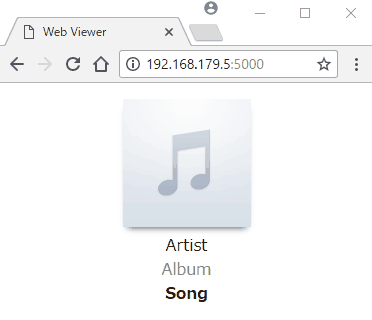
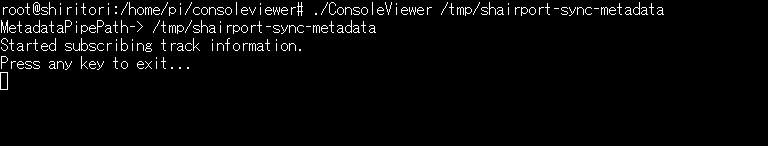

ShairportSync.TrackInfoReader for .NET
===
ShairportSync.TrackInfoReader is a [shairport-sync](https://github.com/mikebrady/shairport-sync) [metadata](https://github.com/mikebrady/shairport-sync#metadata) parser which provides track information (artist, album, song title and artwork image) as `IObservable<TrackInfo>`.

This works on .NET Standard 2.0 compliant platforms like .NET Core 2 / Mono.<br>
(i.e. Raspberry Pi 2/3, Mac, etc.)
## Examples
This repository contains two usage examples below.
#### Web Viewer


#### Console Viewer


## Quick Start
#### Install
Package manager console:
<pre>
<span style="color: silver;"><i>In preparation...</i></span>
</pre>
#### Subscribe Track Information
```csharp
var trackInfoSource = TrackInfoReader.GetObservable("/tmp/shaiport-sync-metadata");
trackInfoSource.Subscribe(t => Console.WriteLine(t.Artist));
```

## Run examples on Raspberry Pi 2/3
#### Preparation
Download, extract and set permission on your Pi.
<pre>
<span style="color: silver;"><i>In preparation...</i></span>
</pre>
Run shairport-sync with metadata pipe parameter.
```bash
shairport-sync --pipe=/tmp/shairport-sync-metadata
```
#### ConsoleViewer
```bash
./ConsoleViewer /tmp/shairport-sync-metadata
```

#### WebViewer
```bash
./WebViewer pipe=/tmp/shairport-sync-metadata
```

Browse ```http://<Pi HostName>:5000/```<br>

## How to Build
Install [NET Core 2.0 SDK](https://www.microsoft.com/net/download/).
#### VisualStudio / Rider
Open `TrackInfoReader.sln`. And Build it.
#### Console
```bash
# Move to solution root directory.
dotnet build
```

#### Publish Build for Pi
```bash
# Move to ConsoleViewer or WebViewer directory.
dotnet publish -c Release -r linux-arm
# Get binaries from ./bin/Release/netcoreapp2.0/linux-arm/publish
```


## License
ShairportSync.TrackInfoReader is Copyright © 2018 idubnori under the [MIT License](./LICENSE).
